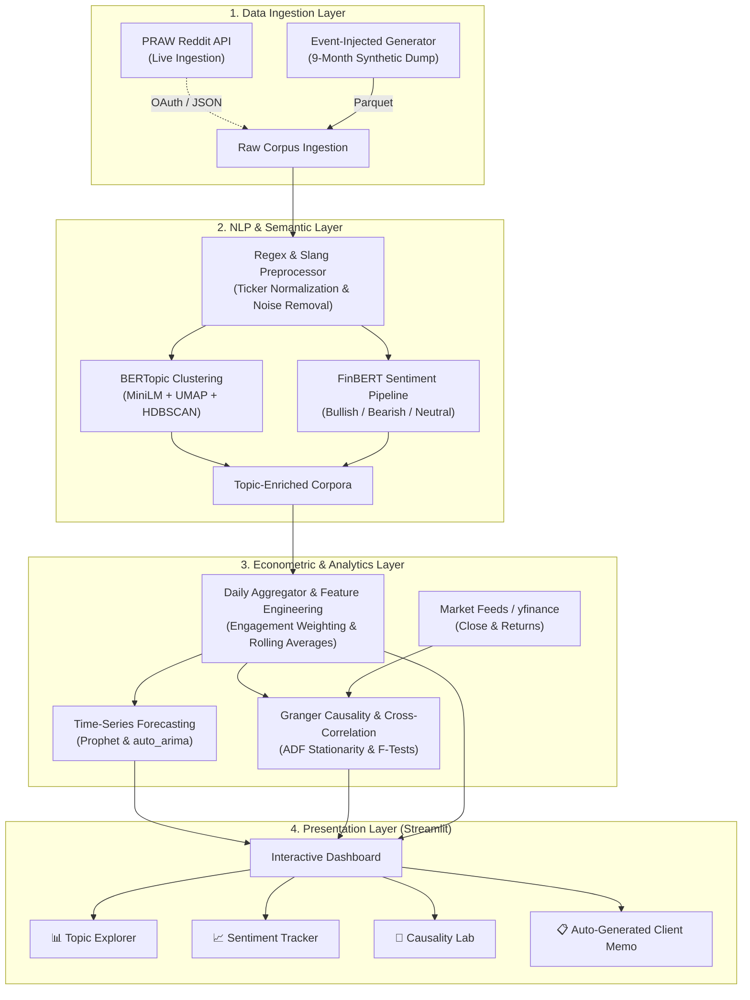

# 📡 Reddit Financial Sentiment Intelligence (Social Listening & Text Mining)

[](https://www.python.org/)
[](https://streamlit.io/)
[](https://huggingface.co/ProsusAI/finbert)
[](https://maartengr.github.io/BERTopic/)
[](https://opensource.org/licenses/MIT)

> **An end-to-end NLP & econometric intelligence platform that extracts actionable signals from unstructured financial discussions across Reddit, clusters emergent market narratives, forecasts sentiment trajectories, and rigorously tests for price lead-lag relationships.**

---

## 📌 Executive Overview

Retail social communities (e.g., `r/wallstreetbets`, `r/CryptoCurrency`, `r/stocks`, `r/Bitcoin`) generate massive volumes of high-velocity, unstructured financial discourse. While retail activity can trigger significant market momentum, the raw text is notoriously noisy, sarcastic, and loaded with evolving internet slang.

This platform implements an end-to-end text mining and predictive pipeline:
1. **Data Ingestion**: Ingests historical discussion corpora via Reddit's official API (`PRAW`) or an event-injected realistic synthetic generator.
2. **Domain-Specific NLP**: Replaces generic sentiment classifiers with **FinBERT** (finance-tuned transformer) and clusters emergent themes using **BERTopic** (MiniLM embeddings + UMAP + HDBSCAN + c-TF-IDF).
3. **Time-Series & Predictive Analytics**: Computes engagement-weighted sentiment indices and forecasts next-period trajectories using **Prophet** and **ARIMA**.
4. **Econometric Hypothesis Testing**: Evaluates whether retail sentiment acts as a statistically significant leading indicator for asset returns via **Augmented Dickey-Fuller (ADF) stationarity testing**, **Granger Causality testing**, and **lagged cross-correlation**.
5. **Interactive Delivery**: Surfaces findings through a multi-page **Streamlit dashboard** and generates automated, exportable **executive client memos**.

---

## 🏗️ System Architecture



---

## 🌟 Key Features

### 1. Robust Data Pipeline
- **Dual Data Modes**: Toggle between live Reddit API scraping with PRAW and a realistic, offline-ready 9-month synthetic data generator with power-law engagement distributions and weekend/weekday seasonality.
- **Injected Historical Market Regimes**: The synthetic generator simulates known macroeconomic and market shock events (e.g., crypto flash crash, meme-stock surges, Fed rate announcements, ETF approvals) to rigorously test discovery capabilities.
- **High-Performance Storage**: Columnar Apache Parquet storage for high I/O throughput and memory efficiency.

### 2. Specialized Financial NLP
- **Finance-Tuned Sentiment (FinBERT)**: Uses `ProsusAI/finbert` pre-trained on corporate filings and financial news, vastly outperforming generic VADER/TextBlob on domain phrases like *"calls printing"*, *"buying the dip"*, or *"insiders dumping"*.
- **Resilient Fallback**: Includes a custom financial lexicon and negation analyzer ensuring zero crashes even in restricted or CPU-only runtime environments.
- **Dynamic Topic Modeling**: BERTopic architecture dynamically extracts n-gram thematic labels without pre-specifying topic counts.

### 3. Quantitative Formulation & Hypothesis Testing
- **Engagement-Weighted Sentiment**: Accounts for social amplification:
  $$\text{Weighted Sentiment}_t = \text{Score}_t \times \ln(1 + \text{Upvotes}_t)$$
- **Granger Causality Hypothesis Testing**:
  Tests the null hypothesis ($H_0$) that past sentiment does *not* provide statistically significant information for predicting price returns beyond past price returns alone:
  $$Y_t = \alpha + \sum_{i=1}^{p} \beta_i Y_{t-i} + \sum_{j=1}^{q} \gamma_j X_{t-j} + \varepsilon_t$$
  Evaluates both causal directions: $\text{Sentiment} \to \text{Price}$ and $\text{Price} \to \text{Sentiment}$.
- **Stationarity Enforcement**: Automated Augmented Dickey-Fuller (ADF) unit root testing with first-differencing transformations to prevent spurious correlations.

### 4. Enterprise-Grade Dashboard & Client Memo
- Built in Streamlit with customized Plotly dark-themed visualizations.
- Auto-generates a one-page, publication-ready executive memo summarizing bullish/bearish signals, confidence intervals, and model caveats.

---

## 📂 Project Repository Structure

```
reddit_sentiment_intel/
├── app.py                          # Streamlit application entry point & pipeline runner
├── config.py                       # Central configuration (paths, tickers, hyperparams)
├── requirements.txt                # Pinned production dependencies
├── README.md                       # Repository documentation
├── .env.example                    # Sample environment variables for Reddit API
│
├── data/
│   ├── raw/                        # Raw scraped / generated posts (reddit_posts.parquet)
│   ├── processed/                  # Enriched posts, daily aggregations & causality results
│   └── forecasts/                  # Prophet & ARIMA trajectory forecasts
│
├── src/
│   ├── __init__.py
│   ├── data_collection/
│   │   ├── __init__.py
│   │   ├── synthetic_generator.py  # Realistic 9-month Reddit data generator
│   │   └── reddit_scraper.py       # PRAW-based live Reddit ingestion module
│   │
│   ├── nlp/
│   │   ├── __init__.py
│   │   ├── preprocessor.py         # Text cleaning, ticker extraction & regex normalization
│   │   ├── topic_modeling.py       # BERTopic pipeline (with TF-IDF/KMeans fallback)
│   │   └── sentiment.py            # FinBERT pipeline (with financial keyword fallback)
│   │
│   ├── analytics/
│   │   ├── __init__.py
│   │   ├── aggregator.py           # Daily time-series aggregator & rolling features
│   │   ├── forecaster.py           # Prophet & ARIMA forecasting module
│   │   └── causality.py            # Granger causality, ADF test & cross-correlation
│   │
│   └── utils/
│       ├── __init__.py
│       └── plotting.py             # Reusable Plotly chart suite with unified dark styling
│
└── pages/
    ├── 1_📊_Topic_Explorer.py       # Topic clustering, volume over time, and post drill-down
    ├── 2_📈_Sentiment_Tracker.py    # Time-series sentiment trajectories & ticker drill-downs
    ├── 3_🔬_Causality_Lab.py        # Interactive Granger causality & lead-lag testing
    └── 4_📋_Client_Memo.py          # Auto-generated 1-page executive summary & report export
```

---

## 🖥️ Dashboard Walkthrough

| Page | Key Capabilities |
| :--- | :--- |
| **🏠 Overview** | Global KPI cards (Total Posts, Net Sentiment Polarity, Active Narratives, 7-day Trend), real-time sentiment distribution donut chart, and cross-subreddit sentiment heatmap. |
| **📊 Topic Explorer** | Interactive stacked area chart of narrative volume over time, topic positioning bubble chart (volume vs sentiment), top n-gram keywords, and raw post inspection. |
| **📈 Sentiment Tracker** | Multi-resolution sentiment time-series (Raw, 7d MA, 14d MA), engagement-weighted vs unweighted comparison, ticker-specific drill-down, and Prophet 14-day forecasts with 95% confidence bands. |
| **🔬 Causality Lab** | Interactive econometric testing suite. Select any asset (`BTC`, `ETH`, `AAPL`, `TSLA`, `GME`, `NVDA`, `SPY`), run ADF stationarity verification, bidirectional Granger causality F-tests (lags 1–14), and cross-correlation heatmaps. |
| **📋 Client Memo** | Auto-synthesized one-page executive memo written in plain English, highlighting top drivers, market risks, forecasting trajectories, and download button for markdown report export. |

---

## ⚡ Quick Start

### 1. Clone the Repository
```bash
git clone https://github.com/your-username/reddit-financial-sentiment-intelligence.git
cd reddit-financial-sentiment-intelligence
```

### 2. Create and Activate a Virtual Environment
```bash
# Windows
python -m venv venv
venv\Scripts\activate

# Linux / macOS
python3 -m venv venv
source venv/bin/activate
```

### 3. Install Dependencies
```bash
pip install -r requirements.txt
```

### 4. (Optional) Configure Live Reddit Scraping
By default, the platform runs instantly in **synthetic demonstration mode** without requiring credentials. If you wish to pull live Reddit data:
1. Create a script application at [Reddit App Preferences](https://www.reddit.com/prefs/apps).
2. Copy `.env.example` to `.env`:
   ```bash
   cp .env.example .env
   ```
3. Fill in your credentials:
   ```env
   REDDIT_CLIENT_ID=your_client_id_here
   REDDIT_CLIENT_SECRET=your_client_secret_here
   REDDIT_USER_AGENT=SentimentIntel/1.0 (by /u/your_username)
   ```
4. Set `USE_SYNTHETIC_DATA = False` in `config.py`.

### 5. Launch the Streamlit Dashboard
```bash
streamlit run app.py
```
Open [http://localhost:8501](http://localhost:8501) in your browser. Click **"🚀 Run Full Pipeline"** in the sidebar to execute data generation, NLP enrichment, aggregation, and forecasting.

---

## 🧪 Running the Pipeline Programmatically

You can also run or verify the full end-to-end pipeline directly via the Python CLI:

```python
from src.data_collection.synthetic_generator import generate_data
from src.nlp.preprocessor import preprocess
from src.nlp.sentiment import analyze_sentiment
from src.nlp.topic_modeling import fit_topics
from src.analytics.aggregator import aggregate_daily, add_rolling_features, save_aggregations
from src.analytics.forecaster import run_all_forecasts
from src.analytics.causality import run_full_causality_analysis

# 1. Ingest
raw_df = generate_data(n_posts=5000, months=6)

# 2. Preprocess & Score Sentiment
clean_df = preprocess(raw_df)
sentiment_df = analyze_sentiment(clean_df)

# 3. Cluster Topics
topics_df, topic_model = fit_topics(sentiment_df)

# 4. Aggregate Time Series
agg_dict = aggregate_daily(topics_df)
for key in agg_dict:
    agg_dict[key] = add_rolling_features(agg_dict[key])
save_aggregations(agg_dict)

# 5. Forecast & Test Causality
forecast_results = run_all_forecasts(agg_dict)
causality_results = run_full_causality_analysis(agg_dict["by_ticker"])
print("Pipeline successfully executed!")
```

---

## ⚙️ Configuration Reference

All settings can be customized in [`config.py`](config.py):

| Parameter | Default | Description |
| :--- | :--- | :--- |
| `USE_SYNTHETIC_DATA` | `True` | Set `False` to ingest via live Reddit PRAW API. |
| `TARGET_SUBREDDITS` | `["wallstreetbets", "CryptoCurrency", "stocks", "Bitcoin"]` | Monitored subreddits. |
| `SYNTHETIC_NUM_POSTS`| `10000` | Post volume generated in synthetic mode. |
| `SYNTHETIC_MONTHS` | `9` | Historical time window in months. |
| `EMBEDDING_MODEL` | `"all-MiniLM-L6-v2"` | SentenceTransformer embedding backbone. |
| `SENTIMENT_MODEL` | `"ProsusAI/finbert"` | Hugging Face model identifier for financial sentiment. |
| `FORECAST_HORIZON_DAYS`| `14` | Forward forecasting period in days. |
| `GRANGER_MAX_LAGS` | `7` | Maximum lag order evaluated in Granger testing. |
| `SIGNIFICANCE_LEVEL`| `0.05` | Statistical significance threshold ($\alpha$). |

---

## 📈 Methodology & Analytical Nuances

1. **Why MiniLM for Topics + FinBERT for Sentiment?**
   Generating 768-dimensional transformer embeddings over thousands of documents during topic clustering is computationally redundant. We pair high-throughput sentence transformer embeddings (`all-MiniLM-L6-v2`) with UMAP for dimensionality reduction, while reserving `ProsusAI/finbert` exclusively for sentiment inference where domain precision is paramount.

2. **Predictive Precedence vs. True Causation**:
   A statistically significant Granger causality result ($p < 0.05$) does **not** prove true causation. It demonstrates that historical changes in retail sentiment contain informational precedence that reduces the variance of price forecast errors beyond price autoregression alone.

3. **Inversion and Context Hazards**:
   Financial sentiment is heavily asset-dependent (e.g., falling crude oil prices are bearish for energy stocks but bullish for airlines). The pipeline incorporates asset-specific tagging to isolate ticker-specific contextual mentions from market-wide macroeconomic narratives.

---

## 🛡️ Disclaimer

This software is developed strictly for research, educational, and text mining demonstration purposes. It does not constitute financial, investment, or legal advice. Historical social sentiment trends and econometric lead-lag tests are not guarantees of future market performance.

---

## 📄 License

This project is licensed under the [MIT License](LICENSE).
